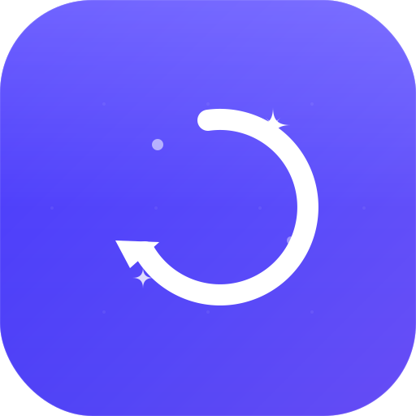

<div align="center">



# SwiftClean

**A fast, private, ad-free PC cleaner & optimizer for Windows.**

Reclaim disk space, clean leftover registry entries, manage startup apps, audit installed
programs, visualize disk usage, check drivers, and automate cleanups — all from one polished
dark-themed desktop app.

[](#)
[](#)
[](#)
[](#)
[](#)

</div>

---

## What is SwiftClean?

SwiftClean is a native Windows desktop utility that helps you keep your PC fast, tidy, and
private. Unlike many "cleaner" tools, it has **no ads, no subscriptions, and no telemetry** —
it never sends your data anywhere. Every screen is wired to **real Windows data**: nothing is
faked or simulated.

It's built with **WPF on .NET 8**, ships as a single dark-themed window, and is fully
**bilingual (English / Русский)** with live language switching.

> ⚠️ **Note:** The **Drivers** page is still under active development and may behave
> unexpectedly. Everything else is stable.

---

## ✨ Features

SwiftClean is organized into nine pages:

| Page | What it does |
|------|--------------|
| 🏠 **Dashboard** | At-a-glance stats — junk found, registry issues, startup impact, free space — plus a live disk-usage breakdown. |
| 🧹 **Cleaning** | Scans and removes temporary files, caches, the Recycle Bin, per-browser cache & cookies (Chrome, Edge, Brave, Opera, Yandex, Vivaldi, Firefox). Expandable previews show exactly which files will go; deletions prefer the Recycle Bin over hard deletes. |
| 🗄️ **Registry** | Finds leftover uninstall entries pointing to folders that no longer exist and safely removes the orphaned keys. |
| 🚀 **Startup** | Lists everything that launches with Windows (Run keys + Startup folders), shows a publisher/size/impact heuristic, and lets you enable/disable entries the Task-Manager way. |
| 📦 **Apps** | Inventory of installed programs with publisher, size, install date, and a best-effort *last-used* date. Sortable, with one-click uninstall. |
| 💽 **Disk** | Real total/used/free figures, large-folder shortcuts, and a **squarified treemap** of disk usage by file type (video, photos, audio, documents, archives, apps…). |
| 🔧 **Drivers** *(beta)* | Enumerates installed device drivers via WMI and checks them against **Windows Update**; updates download & install through the Windows Update API. |
| ⏱️ **Scheduler** | Creates a real Windows Task Scheduler job to auto-clean on a chosen frequency and time. Runs headlessly in the background. |
| ⚙️ **Settings** | Language, notifications, "start with Windows," and other preferences — persisted to disk. |

### Highlights

- **100% real data** — scanning, cleaning, registry, startup, apps, disk analysis, and drivers all read/act on your actual system.
- **Safety first** — destructive actions are confirmed in-app and prefer the Recycle Bin; system/protected files are skipped.
- **Bilingual** — English (default) and Russian, switchable live with no restart.
- **Private & free** — no ads, no tracking, no accounts.

---

## 📥 Installation

### For end users (recommended)

1. Download **`SwiftCleanSetup.exe`** (the single-file installer).
2. Run it — the wizard walks you through **Welcome → License → Location → Install → Done**.
   It installs to `C:\Program Files\SwiftClean`, creates Desktop/Start-Menu shortcuts, and
   registers a proper Windows uninstall entry. (Administrator rights are requested.)
3. Launch **SwiftClean** from the Desktop or Start Menu.

> The installer is self-contained — **.NET does not need to be installed separately.**

### Uninstalling

Remove SwiftClean like any other app: **Settings → Apps → SwiftClean → Uninstall**, or via
Control Panel. A windowed uninstaller opens with a confirmation, progress, and a summary — and
an option to **keep your user settings** if you plan to reinstall later.

---

## 🛠️ Building from source

### Prerequisites

- Windows 10 / 11
- [.NET 8 SDK](https://dotnet.microsoft.com/download/dotnet/8.0)

### Run the app

```bash
git clone https://github.com/<your-user>/SwiftClean.git
cd SwiftClean

dotnet build                                   # build
dotnet run --project SwiftClean.csproj         # build & launch
dotnet test                                    # run the unit tests
```

### Build the installer

The installer is a **separate WPF project** that embeds the published app as a payload.
A single script does the whole pipeline:

```powershell
./build-installer.ps1
```

This (1) publishes SwiftClean self-contained for `win-x64`, (2) zips it into the installer's
embedded payload, and (3) publishes the installer as a single self-contained exe at
**`dist/SwiftCleanSetup.exe`**.

---

## 🏗️ Architecture

SwiftClean follows an **MVVM** structure. The whole UI is a single window with one
`MainViewModel` driving every page; each page is a `UserControl` shown/hidden by binding.

```
Views/         XAML pages (Dashboard, Cleaning, Registry, Startup, Apps, Disk, Drivers, Scheduler, Settings)
ViewModels/    MainViewModel — all application state & commands
Models/        Domain types (CleanItem, RegistryIssue, StartupApp, DriverInfo, …)
Services/      Real Windows logic — ScannerService, CleanerService, RegistryService,
               StartupService, AppsService, DriverService, SchedulerService, …
Helpers/       Shared utilities (RelayCommand, Loc, converters, SizeFormatter, TreemapPanel)
Resources/     Styles & color tokens (dark theme)
tests/         xUnit tests (formatters, localization parity, converters)
installer/     Standalone WPF installer/uninstaller project
```

**Tech stack:** WPF · .NET 8 (`net8.0-windows`) · MVVM · WMI (`System.Management`) ·
Windows Update Agent API · Task Scheduler.

---

## 🌍 Localization

The UI ships in **English (default)** and **Russian**, driven by a single `Loc` dictionary.
Switching language in Settings updates every string live. Key/placeholder parity between the
two languages is enforced by unit tests.

---

## 🔒 Privacy

SwiftClean collects nothing and phones home to no one. All scanning and cleaning happens
locally on your machine.

---

## 📄 License

Free for personal use — provided "as is," without warranty. See the license shown during
installation for full terms.

© 2025 Vyacheslav Protsenko
